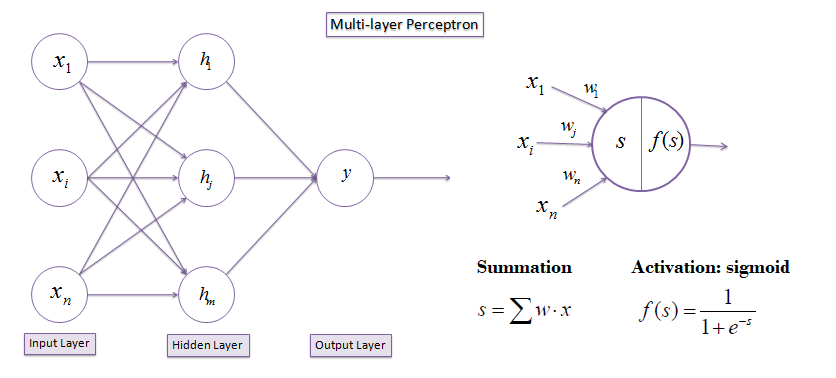
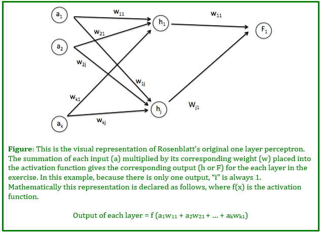

CUDA - Character Recognition
========================

**Summary:** For this homework assignment, you'll be implementing a small neural network for recognizing characters from very simplified black and white images.We've given you the bitmap compression methods; however, a lot of the rest of the neural network implementation is up to you.

*Note: We have provided an explanation of steps to create a fully functioning network with a few perceptron layers; however, if you'd like to make your implementation more detailed, feel free to do so. Make sure to speak with the TAs if you have ideas for [extra credit](#Optional-Extra-Credit) or would like to go more in depth with your approach.*

## Part 0: Build

This project (and all other CUDA projects in this course) requires an NVIDIA graphics card with CUDA capability. Any card with Compute Capability 3.0 (GTX 6xx and newer) or greater will work. Check your GPU on this [compatibility table](https://developer.nvidia.com/cuda-gpus). If you do not have a personal machine with these specs, you may use those computers in the Moore 100B/C which have supported GPUs, but pay close attention to the **setup** section below.

**HOWEVER**: If you need to use the lab computer for your development, you will not presently be able to do GPU performance profiling. This will be very important for debugging performance bottlenecks in your program. If you do not have administrative access to any CUDA-capable machine, please email the TA.

### 0.1 Setup - The Usual

See Project 0, Parts 1-3 for reference.

**CMake note:** Do not change any build settings or add any files to your project directly (in Visual Studio, Nsight, etc.) Instead, edit the `CMakeLists.txt` file. Any files you create must be added here. If you edit it, just rebuild your VS/Nsight project to sync the changes into the IDE.

Please run the project without modifications to ensure that everything works correctly.

**NOTE: Build the project in `release` mode for performance analysis and capturing.**

### 0.2 Useful existing code && where to write things

* `character_recognition/common.h`
  * `checkCUDAError` macro: checks for CUDA errors and exits if there were any.
  * `ilog2ceil(x)`: computes the ceiling of log2(x), as an integer.
* `main.cpp`
  * Implement the network to run here
* Make sure your startup project is set to `cis565_character_recognition`. All your MLP/neuralnetwork code implementation will be in the `character_recognition` project.

## Part 1: Multi-layer Perceptron

### Part 1.0: What is a Perceptron and how will it be used in this assignment?

A single-layered perceptron works as follows. Throughout the entire process the data follows the feed forward method. This method indicates that data can only pass from one column to the next, traveling only in the input to output direction. To begin, a set of data is inputted into the perceptron. This data is then multiplied by a series of activation weights corresponding to the input’s location and the output layer's location. These weights are used to determine the importance or the "weight" each specific input will have in determining the output. All of these products with the same corresponding output location are then summed up and put through the activation function. This function determines, based on what the user wants, whether or not the output is above the user-specified threshold (just like in circuits).

For our purposes we are using `f(x) = 1/(1+e^-x)`. Depending on the output of this function, the output of the specified node will be considered as “on” or “off.” For our purposes with the multi-layered perceptron, we are hooking up two layers of perceptrons; therefore, we are ultimately working with three layers.

Just as before, the input follows the feed forward method, traveling from the initial input layer to the final output layer; however, in between the two previous input and output layers now exists another layer that corresponds as the output to the initial input layer and the input to the final output layer. This input/output layer is called the hidden layer. Therefore, the weights from the first input to the hidden layer are called `w_kj` and the weights from the hidden layer to the final output layer are called `w_ji`. 

For all instances regarding the multi-layer perceptron, variables `k`, `j`, and `i` will only correspond to the input location, the hidden layer location, and the output location respectively. (If you'd like to add more layers, feel free to do so, just make sure to note it in your writeup.)

Each time this multi-layer is run through, an error in the difference between the actual output and the theoretical output due to each specific weight is calculated. This value is then multiplied by a negative lambda value to give the delta to be added to that specific weight to lessen the error in the overall system.

**The formulas used in this perceptron along with further explanations of the mathematical reasoning behind this model can be found in the [RECITATION PDF](./Minimizing-and-Optimizing-the-Error-Function.pdf).**

### Part 1.1: Creating your Multi-layer Perceptron

Create three buffers such that one corresponds to each of the following
- input
- hidden layers
- output

Create your weight matrices as 1D buffers with proper indexing into them so you can access their information easily.

### Part 1.2: Creating your Neural Network

After intializing necessary quantities by asking the user if training, set the inputs for the multi-layer perceptrons (ie input->hidden and hidden->output) with values corresponding to the proper inputs. Note if training, the weights `w_kj` and `w_ji` should be random within a certain range, and if not these weights should be the same as the previous run through.

The system should initially be set to running so that main continues calling your run method until the user wishes to stop. When working with your variables, make sure to set your initial `totalError` to a value greater than your initial `targetError` to allow for run to actually work the first time through (this initial value does not end up being used anywhere; it is immediately replaced by the proper calculated value).

## Part 2.0: Training your Data

### Part 2.1: Using just number inputs and a small network

Instead of pulling directly from the image and starting on a larger data set, start with a smaller example to check your math. Remember from recitation the 2x2 XOR [excel file example](./2x2_XOR_excel_example.xlsx); use that as an initial testing sample for your newly coded implementation to see if you get the same numbers for both the excel and your implementation for the first pass through your network.

### Part 2.2: Expand so it works for your image inputs

In the `data-set` folder, we have already provided the compressed and converted information of how the bitmap testing data is represented in txt format. Continue running / training on this set until you get weights that yield close to the correct solution within a decent error range.

## Part 3.0 Testing your Data

Setup a separation between training and testing your code (through use of a boolean or flag). If you assume your trained weights work, test it on the given image inputs. If they work, make sure to store these weight values in a separate file so we can test them to confirm. Feel free to also screenshot a written output to show it works.

Try to get your project fully working, but we will grade this section based on how many people were successful in getting their network working compared to how many who weren't in the time alotted (we do understand that training takes time, so we'll be reasonable here).

## Part 4: Write-up

1. Take a screenshot of the written output you have confirming final error in relation to your network and its target values (ie how close did it get to being able to determine if an image contains a specific character). Put this at the top of your README.md. Take a look at [How to make an attractive GitHub repo](https://github.com/pjcozzi/Articles/blob/master/CIS565/GitHubRepo/README.md).
2. Add your performance analysis. Graphs to include:
- Framerate change with increasing # layers in your perceptron
- Framerate change with increasing # of hidden perceptron layers (if you'd like to do this)
- Framerate change for larger image sizes as input in comparison to smaller image sizes
- If you implemented Extra credit, make sure to include graph comparisons for those
3. If you do any extra credit, make sure to note it in your readme (otherwise we won't give credit for it).

## Tips
- If your simulation crashes before launch, use `checkCUDAErrorWithLine("message")` after CUDA invocations
- `ctrl + f5` in Visual Studio will launch the program but won't let the window close if the program crashes. This way you can see any `checkCUDAErrorWithLine` output.
- For debugging purposes, you can transfer data to and from the GPU. See `Boids::unitTest` from Project1's `kernel.cu` for an example of how to use this.
- Your README.md will be done in github markdown. You can find a [cheatsheet here](https://guides.github.com/pdfs/markdown-cheatsheet-online.pdf). There is also a [live preview plugin](https://atom.io/packages/markdown-preview) for the [atom text editor](https://atom.io/) from github. The same for [VS Code](https://www.visualstudio.com/en-us/products/code-vs.aspx)

## Optional Extra Credit:

`Center of Mass`:
Create your own black and white images where the initial character is not centered in the image. That is, you'd need to add a 'center of mass' function to find the main location of the letter and crop out extraneous information. Make sure when testing this that you have multiple images of the same character in different locations in your testing group.

`Matrix Multiply`:
Change the initial setup so that instead of doing it in a 1d vector for input to output, do it as a matrix multiplication of the weights between each layer of the overall network. Follow the matrix multiply optimization from the intro to CUDA slides.

`Confusing Color`: 
Test with varying color image versions (note: if you implement this, please make sure to include these when you submit your hw). You will need to perform your own bmp conversion or load in the appropriate files to input.
