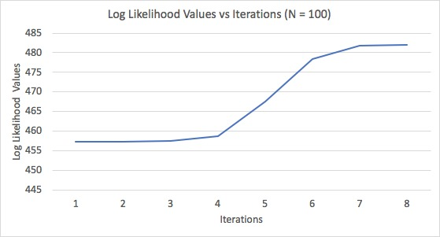

**University of Pennsylvania, CIS 565: GPU Programming and Architecture, Final Project: Point Cloud Registration Using Gaussian Mixure Models**

* SOMANSHU AGARWAL [LinkedIn](https://www.linkedin.com/in/somanshu25)
* SRINATH RAJAGOPALAN [LinkedIn](https://www.linkedin.com/in/srinath-rajagopalan-07a43155)
* DHRUV KARTHIK [LinkedIn](https://www.linkedin.com/in/dhruvkarthik/)

 

## Table of Contents

1. [Introduction](#Introduction)
2. [Gaussian Mixure Models](#Gaussian-Mixure-Models)
3. [Probabilistic Models vs ICP](#Probabilistic-Models-vs-ICP)
4. [Algorithms](#Effects)
5. [Use Cases](#Optimization)
6. [Performance Analysis](#Analysis)
7. [Future Work](#Future-Work)
8. [References](#References)

## Introduction

Point cloud registration is greatly used in the field of computer vision applications such as localization technically, to merge maps produced by different sensors. Using detereministic approached such as Iterative Closest point (ICP) works well for some of the cases, but it suffers the issue of coverging to local minima and not aligning the poinclouds properly, especially in case where a dense point cloud data has to be aligned to the saprse one. One of the ways to improve this limitation is to use probablistic models and learn distributions on the point cloud data and align the distributions itself. Hence, each point in the source point cloud is associated with a set of points in the target point cloud; each association is then weighted so that the weights form a probability distribution. We are using Gaussian Mixure Model which is driven by expectation maximization algorihtm to learn the distributions on the point cloud data and align them. We will be comparing the CPU and GPU implementation and showcase some of the applications such as unsupervised segmentation and localization. Later on, we will demonstrate a faster approach of GMM model, using Hierarchical Gaussian Mixure Model to learn the distirbutions in logarithmic time. 

## Gaussian Mixure Models

Gaussian Mixure Model (GMM) is the unsupervised probabilistic modelling technique for representing normally distributed subpopulations within an overall population. This is unsupervised as we do not have information about the subpopulations. We estimate the information about subpopulations using Expectation-maximization algorithms. We can apply GMM modelling to both 2D and 3D points to represent the clustering points in the space. The 2D and 3D representations are shown in the figures below.

### Gaussian Mixure Models for 2D Dataset:

Before Clustering            |  After Clustering
:-------------------------:|:-------------------------:
|  

### Gaussian Mixure Modelling for 3D Dataset

The Gaussian Mixure Models are implemented on Stanford Bunny for visualizing GMM in 3D point cloud data. The below two gifs show for 100 and 800 components respectively.

100 Components             |  800 Components
:-------------------------:|:-------------------------:
| 		

## Probabilistic-Models-vs-ICP

Iterative Closest point (ICP) algorithm is point to poitn approach where we try to match the correspondence for each source to the target point cloud data. The algorithms tries to align each source point to its nearest target point by using the SVD optimization to get the transformation parameters (Rotation and translational in case of rigid transformation) and we kepp doing the process iteratively till the loss converges to a minimum value. The drarback of the above algorithm is that it tries to align source's center of mass with the target one. In this process, the optimization might converge to the local minima where the point cloud data are not purely aligned, as mentioned in the figures below.

 

Probabilistic ways tend to work better in case of computer vision applications which we have studies in our project work.

## Algorithms and implementation Details 

In our project, we have looked at various algorithms to perform Gaussian Mixure Models. We have looked at the standard Gaussian mixure model algorithm with full, disagonal and spherical covariances updates. Our implementation includes the usage of Numba and CuPy kernels in Python to compare the performance of CPU and GPU implementations. We also implemented EM algorithm in C++ version before shifting to Python version because of the issues we were facing to integrate Open3D visualizer due to limited resources. 
## Use cases

### Unsupervised Segmentation

In the case of supervised image segmentation, the architectures in general assigns labels to pixels that denote the cluster to which the pixel belongs. In the unsupervised scenario, however, no training images or ground truth labels of pixels are given beforehand. Therefore, once when a target image is input, we jointly labels together with feature representations while minimizing the cost function using optimization. In our case, clustering can be used as a way to segment the features which are alike in the same gaussian. More the number of compoennts, more finer the groups will become. We will use our GPU implementation to speedup the clustering and segment the image faster. The reference for the unsupervised image segmentation can be seen [here](https://kanezaki.github.io/pytorch-unsupervised-segmentation/).

With CPU Implementation            |  With GPU Implementation
:-------------------------:|:-------------------------:
)|  

### Localization

The self-localization of mobile robots in the environment is one of the most fundamental problems in the robotics navigation field. Aligning the frames from the data received through the sensors (LIDAR point cloud data) can help us to locate and trace the path of the robot. The rotation and translational paramenters required for the robot to stay in the path could be dteremined from the parameters recieved through the point cloud registration. The follwing implementation could be fasteted using the GPU implementations.

With CPU Implementation            |  With GPU Implementation
:-------------------------:|:-------------------------:
)|  

## Performance Analysis

The plot of log Likelihood value as the function of number of iterations is given below. (The code was run on C++ implementation of EM algorithm). 

With 100 Components            |  With 500 Components
:-------------------------:|:-------------------------:
)|  

The performance analysis of CPU and GPU implmentations are shown below:

The above graphs mention that GPU performance improves with respect to our CPU implementation of point cloud registration.

## References
1. [Point Clouds Registration with Probabilistic Data Association](https://ieeexplore.ieee.org/stamp/stamp.jsp?tp=&arnumber=7759602&tag=1)
1. [Fast and Accurate Point Cloud Registration
using Trees of Gaussian Mixtures](https://arxiv.org/pdf/1807.02587.pdf)
1. [Accelerated Generative Models for 3D Point Cloud Data](https://ieeexplore.ieee.org/stamp/stamp.jsp?tp=&arnumber=7780962)
1. 
