Gaussian Mixture Models for 3D Point Cloud Registration
======================
**University of Pennsylvania, CIS 565: GPU Programming and Architecture 
Final Project**

* Somanshu Agarwal [LinkedIn](https://www.linkedin.com/in/somanshu25)
* Srinath Rajagopalan [LinkedIn](https://www.linkedin.com/in/srinath-rajagopalan-07a43155)
* Dhruv Karthik [LinkedIn](https://www.linkedin.com/in/dhruvkarthik/)

<p align= "center">

 <p/>

## Table of Contents

1. [Introduction](#Introduction)
2. [Gaussian Mixure Models](#Gaussian-Mixure-Models)
3. [ICP Misalignment](#ICP-Misalignment)
4. [GMM Registration with Noisy Targets](#GMM-Registration-with-Noisy-Targets)
5. [Implementation](#Implementation)
6. [Use Cases](#Use-cases)
6. [Performance Analysis](#Analysis)
7. [Requirements for Code](#Requirements-for-Code)
8. [References](#References)

## Introduction

Representing continuous geometry via discretizing point clouds introduces artifacts and does not enable us to deal with noise or uncertainity in the data. Also, discrete representations are non-differentiable. Having a probabilistic representation of point clouds can be used for up-sampling, mesh-reconstruction, and effectively dealing with noise and outliers. In this project, we focus on training Gaussian Mixture Models, a class of generative models, on 3D Point Clouds. Subsequently, we use learned GMM for Point Cloud Registration. PCR is extensively used in the computer vision and robotics for 3D object mapping, SLAM, dense Reconstruction, 3D pose estimation etc. In autonomous driving, massive ammounts of 3D point cloud data is captured from various sensors (LiDAR) from different coordinate systems. PCR is used to align a pair of point clouds to a common coordinate frame. 

The widely used algorithm for registration, Iterative Closest Point (ICP), does not work well when we are dealing with noise or outliers or if the point cloud data has uneven density or includes occlusion artifacts. Statistical approaches based on GMMs help in addressing these drawbacks but have been slow and inefficient to be used for real-time applications. But with the help of GPU and recent advancements from [Accelerated Generative Models for 3D Point Cloud Data](http://www.kihwan23.com/papers/CVPR16/GMM16.pdf) and [Fast and Accurate Point Cloud Registration using Trees of Gaussian Mixtures](https://arxiv.org/pdf/1807.02587.pdf), we can efficiently scale GMM training and registration on 3D point clouds.

## Gaussian Mixure Models

Gaussian Mixtures model the joint probability distribution of a data via a mixture of normal distrubtions (called components/clusters). The parameters of GMM can be estimated by maximizing the log-likelihood via the Expecation-Maximization algorithm. 

In the following figure, we cluster a set of 2D points with GMM. Unlike KMeans, GMM can be used for soft-clustering where a point can belong to multiple clusters with a corresponding probability.

The following figure illustrates GMM clustering on a set of 2D points

### Gaussian Mixure Models for 2D Dataset:

Before Clustering            |  After Clustering
:-------------------------:|:-------------------------:
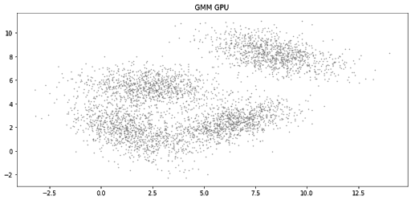|  


Another example,

Before Clustering            |  After Clustering
:-------------------------:|:-------------------------:
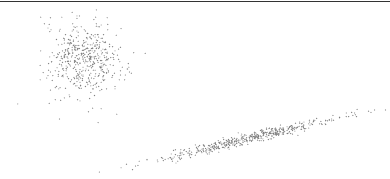|  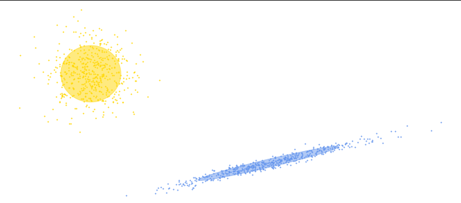


### Gaussian Mixures on 3D Point Clouds

The Gaussian Mixure Models are implemented on Stanford Bunny for visualizing GMM in 3D point cloud data. The below two gifs show for 100 and 800 components respectively.

100 Components             |  800 Components
:-------------------------:|:-------------------------:
| 		


On the Dragon,

10 Components             |  50 Components
:-------------------------:|:-------------------------:
| 		

### Hierarchical Gaussian Mixure Models

The issue with conventional GMM modelling is bottleneck due to linear search over all the components fitting onto the dataset. The GMM modelling requires unnecessary computation for the likelihood of a point to a cluster which is very far from it again and again, which results in reduced efficiency. One of the solutions to prevent search over all the clusters is to implement Hierarchical gaussian Mixture Model tree so as to get benefits of octree structure. While designing the Gaussians in form of trees, it gives us additional benefit of adaptive scaling, hence we can choose some points to be fitted with very small variant Gaussians while some points can be clustered with large variance at same time. The algorithm is GPU-Accelerated construction algorithm which is reliable and parallelizable for maximum benefit from the GPU’s. As mentioned in the reference, the complexity of the algorithms is measured in terms of Associative Complexity, which is complexity of data association problem over all N points (E Step in the case of EM based methods); and Optimization Complexity which is the size of the optimization problem (M Step in the case of EM-based methods). 

<p align= "center">
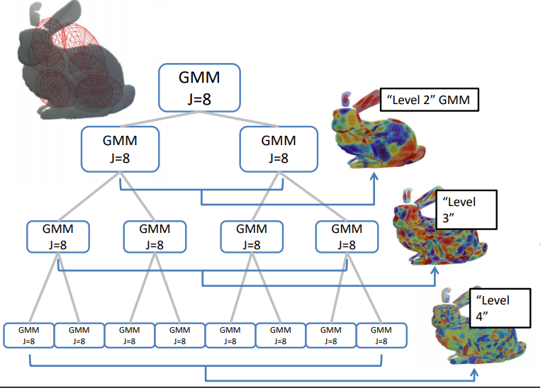
 <p/>

Source Link: [GPU-Accelerated-3d-Point-Cloud-Processing-with-Hierarchical-Gaussian-Mixtures](https://developer.download.nvidia.com/video/gputechconf/gtc/2019/presentation/s9623-gpu-accelerated-3d-point-cloud-processing-with-hierarchical-gaussian-mixtures.pdf)

For N points and J clusters, the complexities of HMM registration and HGMM registration methods are given below:

| Algorithm| Associative Complexity | Optimization Complexity  | Construction Complexity |
| --- | --- |---|---|
| EM-ICP | O(N log N) | O(N<sup>2</sup>) |--- |
| GMM-Reg | O(N) | O(N<sup>2</sup>) |O(NJ)|
| HGMM-Reg | O(N log J ) | O(log J) |O(N log J)|


In our implementation, we have chosen the number of nodes per parent as 8, which implies that each node can be defined as the weighted sum of 8 child Gaussians. Once a point is assigned to a parent node cluster by EM algorithm, the point will later check the likelihood with the child of the associated parent only, hence, the search keeps reducing In exponential order for the points, which leads to high efficiency.

## ICP Misalignment

Iterative Closest point (ICP) estimates correspondence and uses point-to-point comparison for registration. The algorithms tries to align each source point to its nearest target point by using the SVD optimization to get the transformation parameters (Rotation and translational in case of rigid transformation) and we kepp doing the process iteratively till the loss converges to a minimum value. The drawback of the above algorithm is that it tries to align source's center of mass with the target one. In this process, the optimization might converge to the local minima where the point cloud data are not purely aligned, as mentioned in the figures below.

<p align="center">
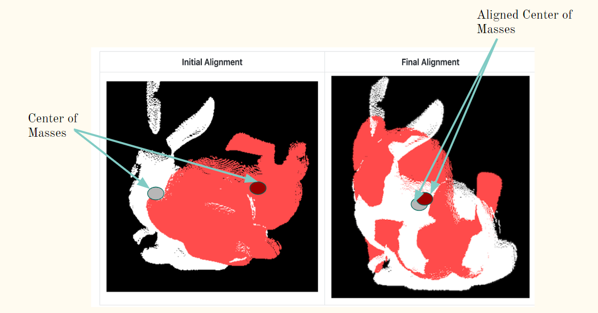
 </p>


 ## GMM Registration with Noisy Targets

Some of the alignments done using the Gaussian Mixure models probabilistic models with the noisy pixels in the target (source is red and target is green color):

Bunny Dataset            |  Dragon Dataset
:-------------------------:|:-------------------------:
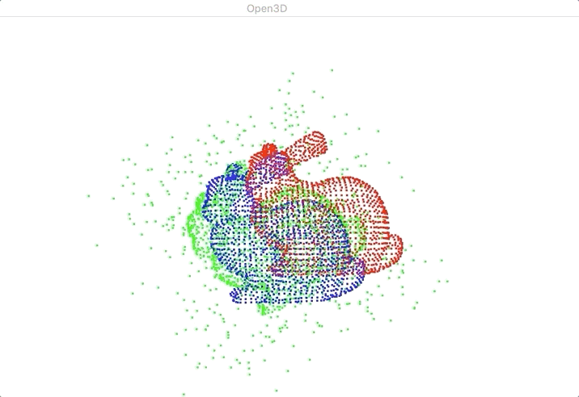|  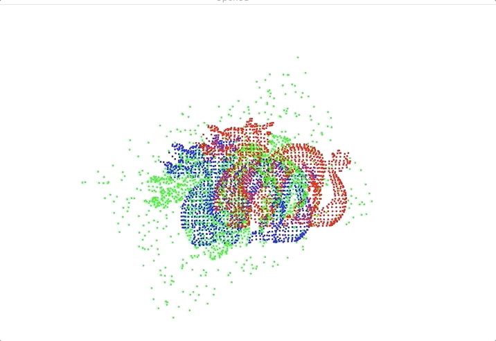


## Implementation 

Initially, we started with a pure C++ approach for GMM, but realized rapid iteration and integrating with other components can't be done easily. So we settled on the following configuration

1) Implement in Python and use [CuPy](https://cupy.chainer.org/) for numpy arrays on the GPU. This allows for accelerated matrix operations (multiply, dot product, reduction etc) on the GPU while providing a NumPy like interface.
2)  For fine-grained control and custom kernels, we use [Numba](http://numba.pydata.org/). Numba enables us to write CUDA kernels in Python that get JIT compiled to CUDA-C code. An example Numba CUDA kernel illustrated below ([source](https://numba.pydata.org/numba-doc/latest/cuda/kernels.html)),

```python
@cuda.jit
def increment_by_one(an_array):
    # Thread id in a 1D block
    tx = cuda.threadIdx.x
    ty = cuda.blockIdx.x
    bw = cuda.blockDim.x

    pos = tx + ty * bw
    if pos < an_array.size:
        an_array[pos] += 1
```
Also, CuPy enables inter-operability with Numba CUDA Device Arrays. So we can seamlessly shift between Numba kernels and CuPy code.

3) We use [Open3D](http://www.open3d.org/) to process and visualize 3D point clouds
4) For reference of CPU implementation and pre-defined transformations, we use [ProbReg](https://github.com/neka-nat/probreg)


## Use cases

### Unsupervised Segmentation

In the case of supervised image segmentation, the architectures in general assigns labels to pixels that denote the cluster to which the pixel belongs. In the unsupervised scenario, however, no training images or ground truth labels of pixels are given beforehand. Therefore, once when a target image is input, we jointly labels together with feature representations while minimizing the cost function using optimization. In our case, clustering can be used as a way to segment the features which are alike in the same gaussian. More the number of compoennts, more finer the groups will become. We will use our GPU implementation to speedup the clustering and segment the image faster. The reference for the unsupervised image segmentation can be seen [here](https://kanezaki.github.io/pytorch-unsupervised-segmentation/).


On the Lounge (10k points with 10 and 50 components)

<p align="center">
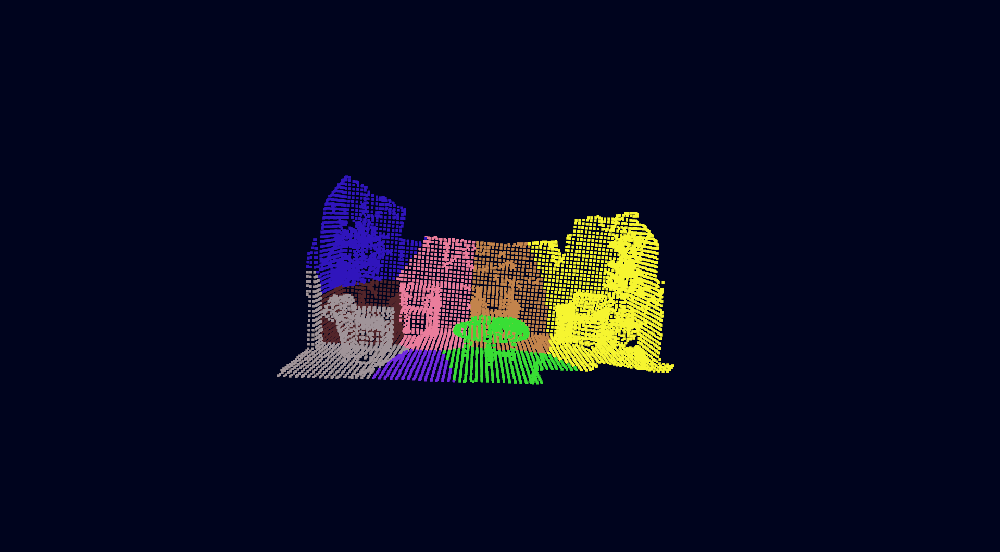
 </p>

<p align="center">
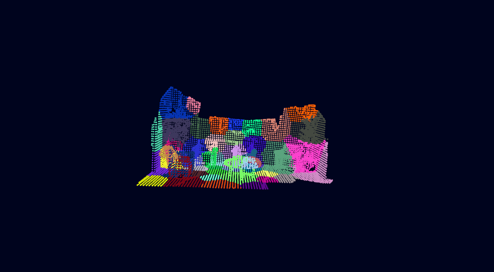
 </p>

On the left image, we can see how different objects in the scene are neatly grouped together. This can serve as a starting point for semantic segmentation.


### GMM on a stream of LIDAR Point Clouds

We can visualize the GMM trained on a sequence of LIDAR point clouds from [Waymo Open Dataset](https://waymo.com/open/)

Starting with just 1k points and 50 Gaussian components (GMM is re-trained every 10 frames),

<p align="center">
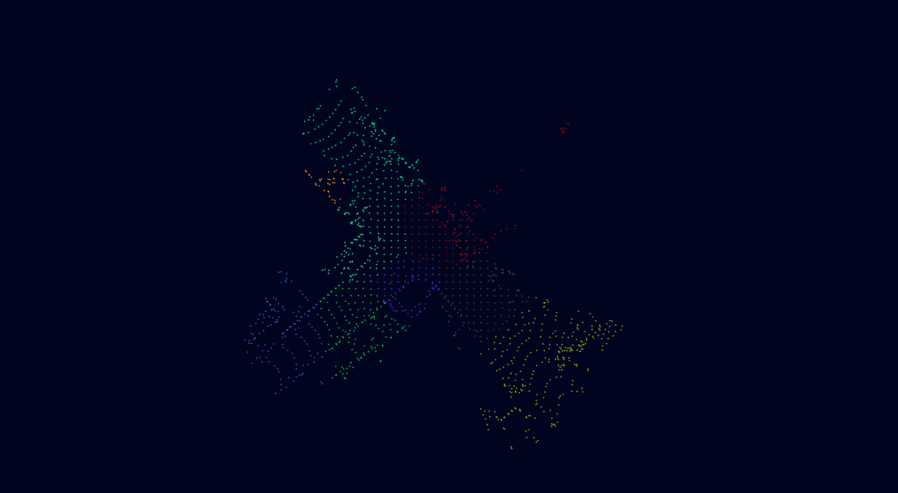
 </p>

With 10k points,

<p align="center">
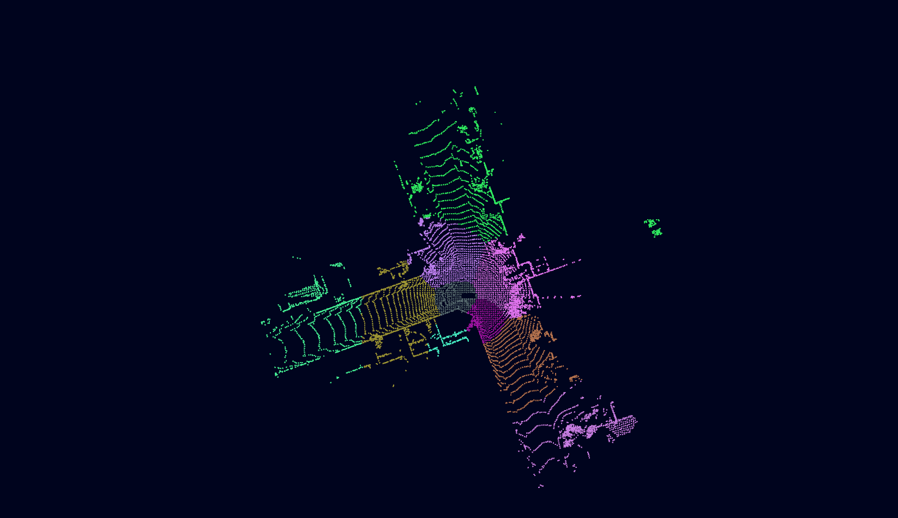
 </p>

With 50k points,


<p align="center">
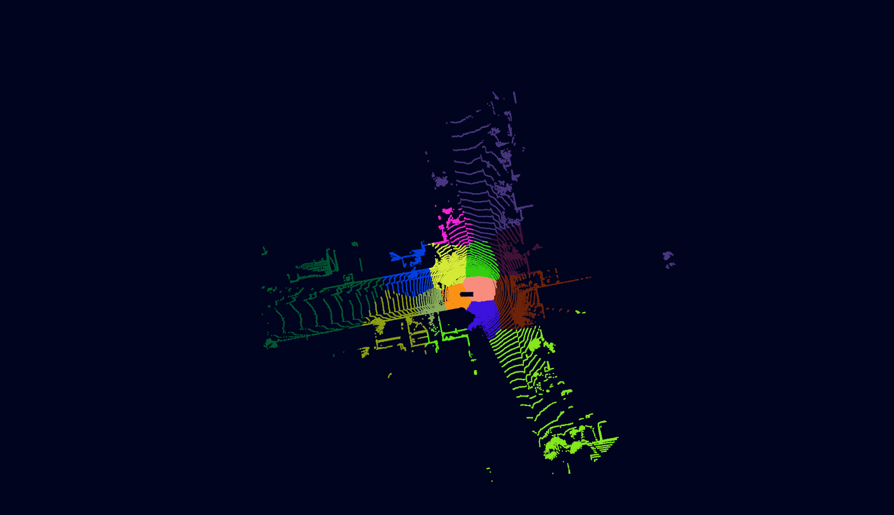
</p>

We have 3 running issues while training GMM on moving point clouds,

1) Since Open3D visualizer is on the CPU, we are forced to initiate a GPU to CPU transfer every frame and that creates a bottleneck for faster real-time visualizations
2) GMM convergence heavily depends on initial parameters. Ideally, the parameters are initialized using KMeans, which introduces additional overhead, so we chose to initialize the parameters randomly due to which for some frames the algorithm converges to a poor local optimum
3) Every time the GMM is re-trained on the incoming point cloud, we have to assign new colours based on new cluster assignments for each point. While being semantically correct, the changing colours are a bit jarring from a visualization perspective. 

### Localization

We can use PCR for state-estimation/localization of a self-driving car/mobile robot. Aligning the frames from the data received through the sensors (LIDAR point cloud data) can help us to locate and trace the path of the robot. The rotation and translational paramenters required for the robot to stay in the path could be dteremined from the parameters recieved through the point cloud registration. 

The following slide from [State-Estimation and Localization for Self-Driving Cars](https://www.coursera.org/lecture/state-estimation-localization-self-driving-cars/lesson-3-pose-estimation-from-lidar-data-XE9kZ) neatly illustrates this,


<p align="center">
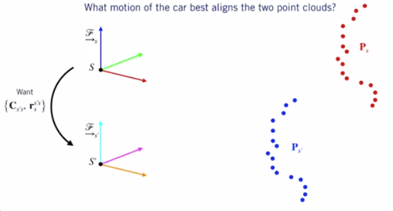
</p>


On Waymo Open Dataset, we use PCR to localize the car. The path of the car is illustrated below.

<p align="center">
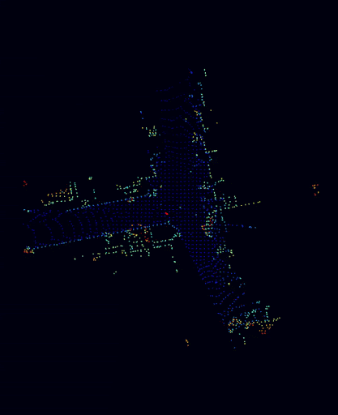
 </p>

<p align="center">
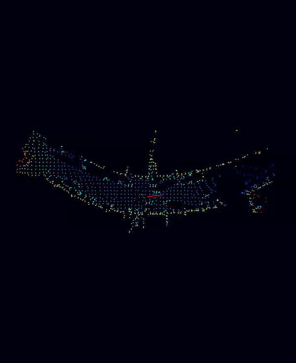
 </p>


The above visual is using a CPU implementation. Unfortunately, due to logistics issues we couldn't recreate it using our GPU implementation.

## Performance Analysis


We compare the CPU and GPU implemenations of GMM trained on 3D point clouds. There are two variations to consider,

1) Performance by varying total number of points
2) Performance by varying total number of components

No. of Points with Time             |  No. of Components with Time
:-------------------------:|:-------------------------:
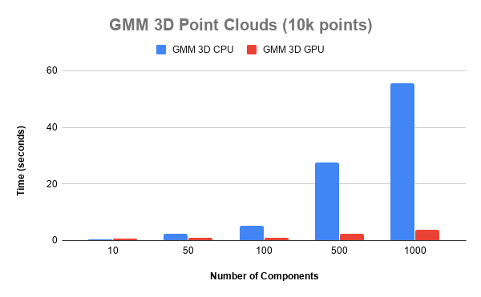| 		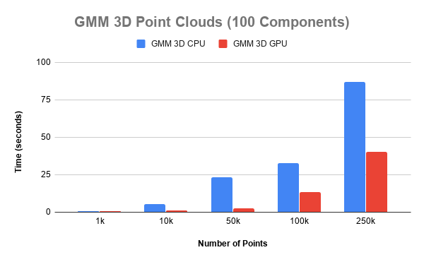


We also evaluate the FPS on Waymo's LIDAR data and compare CPU vs GPU.

<p align="center">

 </p>

 While, the GPU is much faster than the CPU, we are still not close to real-time performance. 
 
 1) For 10k points, while we can achieve close to 10 FPS, we are bottlenecked by Open3D visualizer rendering via the CPU.
 2) For larger point clouds (> 50k points), the GPU to CPU data transfer is no longer the bottleneck. Our GMM implementation itself is not fast enough.

## Requirements for Code:
1.	Python 3.5 or above
2.	Numba  0.43.1
3.	CuPy 7.0.0
4.	Intel Open 3D
5.	Scikit-learn
6.	Probreg 0.1.7
7.	Waymo Open Dataset
8.	Stanford Bunny Dataset
9.	Lounge Dataset

## References
1. [Point Clouds Registration with Probabilistic Data Association](https://ieeexplore.ieee.org/stamp/stamp.jsp?tp=&arnumber=7759602&tag=1)
1. [Fast and Accurate Point Cloud Registration
using Trees of Gaussian Mixtures](https://arxiv.org/pdf/1807.02587.pdf)
1. [Accelerated Generative Models for 3D Point Cloud Data](https://ieeexplore.ieee.org/stamp/stamp.jsp?tp=&arnumber=7780962)

