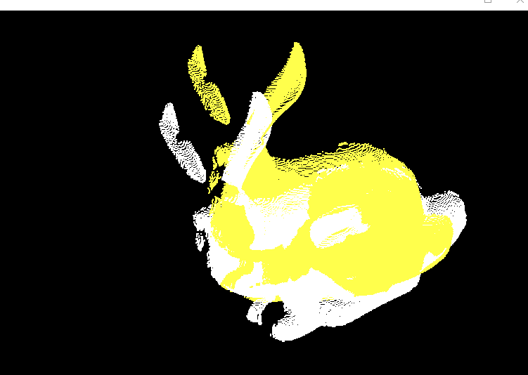
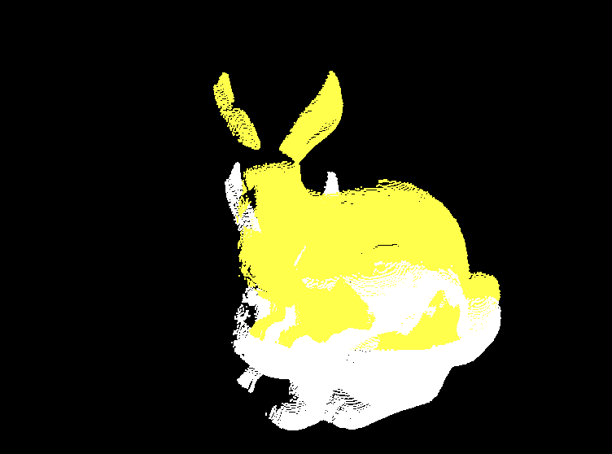

Iterative Closest Point
======================

**University of Pennsylvania, CIS 565: GPU Programming and Architecture, Project 4**

* SOMANSHU AGARWAL
  * [LinkedIn](https://www.linkedin.com/in/somanshu25)
* Tested on: Windows 10, i7-6700 @ 3.4GHz 16GB, Quadro P1000 4GB (Moore 100B Lab)

### Introduction

Iterative Closest Point (ICP) is one of the variants to implement scan matching on two pointclouds which are aligned at an angle and we want to overlap them. The algorithm find the transformation between a point cloud and some reference surface (or another point cloud), by minimizing the square errors between the corresponding entities.

### Theory Behind the Optimization:

The below snippet gives the alogirhtm of ICP in a nutshell:

In above the optimal solution for rotation matrix `R` and the translational matrix `t` can be written in the follwoing manner:

For finding the `U` and `V`, we use the SVD solution by using the below mathematical analysis:

### Different Implementation:

The fowllowing implementations are done to review the performance:
* CPU Naive Implementation
* GPU Naive Implementation
* KD Tree Implmentation in GPU

## CPU Implementation

CPU Implementation of the scan matching involves searching the correspondence point (the closest point) in the target pointcloud (reference) for each of the point in the source pointcloud (which needs to be transformed to target). The search is naive across all the points in the target pointcloud. After finding the correspondance, we are mean centering the source and correspondance points and then finding the SVD for the `XYT`. Then applying the theory mentioned above for finding the optimization, we calculate the rotation and translational matrix for each iteration of the alogorithm and update the source points.

## GPU Naive Implementation

In GPU Naive implementation, the difference with respect to the previous CPU Implementation is that there are `sourceSize` number of parallel threads which are released which compute the closest neighbour for each point in source pointcloud seperately. We cna perform this in parallel as each source point is independent of each other when finding the correspondance point in the target pointcloud. The implementation of mean centering, matirx multiplication and updating the source points are also done in parallel for each point in the source pointcloud to improve the time efficiency. For implementing the matrix multiplication, we used the concept of outer product to calculate the matrixes of each row and column vector pair and then apply the `thrust::reduce` to parallely add them to get the final multiplication result.

## K-d-tree Implementation

In the previous implementations, we are doing the naive search over all the points in the target pointcloud. This makes it less efficient as we are unncesessary going over the points which are very far and also doing global reads for those checks, making it more worse. One of the ways to implement it to search in the most likely regions is using K-d tree implementation.  

The k-d tree is a binary tree in which every leaf node is a k-dimensional point. Every non-leaf node can be thought of as implicitly generating a splitting hyperplane that divides the space into two parts, known as half-spaces. Points to the left of this hyperplane are represented by the left subtree of that node and points to the right of the hyperplane are represented by the right subtree [K-d_tree](https://en.wikipedia.org/wiki/K-d_tree). For our use, I'm building the tree on the host as the building of tree has to de done only once and then later on traversing on the tree every iteration. The storage of the tree is in the form of array. If node position is at `pos`, then the left child is stored at `2*pos +1` and the right child is stored at `2*pos+2` position. 

The difference of this implementation is the traversal to find the correspondance. For iterative solution to find the subtree to find the closest points, we are using stack like array to store the elements so that we can come back to the child not visited and apply the closest neighbour search in the k-d tree. The other implementations are same as that of GPU Naive.

## Comparision Results

The pointclods are created by taking the "bun000.ply" from the Stanford Repository and transforming both the source and target pointclouds so that they can be visualized better.

The scan matching of GIF of all the three implementation are shown in the figures below:

    CPU Naive            |      GPU Naive  |   GPU with k-d tree

  
   
   

     

The time comparision ofCPU vs Naive GPU timing is shown in graph below:

We can see from the above graph that GPU performs way way better than the CPU implementation which was as expected.

The graph below shows the plot for timing of GPU Naive vs GPU k-de tree.

We can observe that the k-d tree gives good improvement over the rest of two implementations after some initial iterations. The reasons for poor initial performance of k-d tree could be linked to more global memory reads and the stack implementation of the k-d tree in GPU in place of normal recursion based approach. In GPU, the recusrsion is not supported and the initial overhead of global memory reads could be impacting the timing. This could be improved by using shared memory which could be taken later on for improving the project.

## Limitations and Further Improvements

One of the limitations of the algorithm is that it cannot exactly scan the pointcloud data which are flipped by very large amount. For example, in the figure shown below, the bunny is rotated by 0 degrees and 180 degrees and the scan macthing gets stuck at when they are exactly flipped.

More better look of the above is shown below, where we can see that the ears are exactly miirror image. There could be more improvement that could be done to improve it.

## References

* [SVD GitHub Link](https://github.com/ericjang/svd3)
* [ICP Implementation Reference](https://github.com/michaelwillett/Iterative-Closest-Point)
